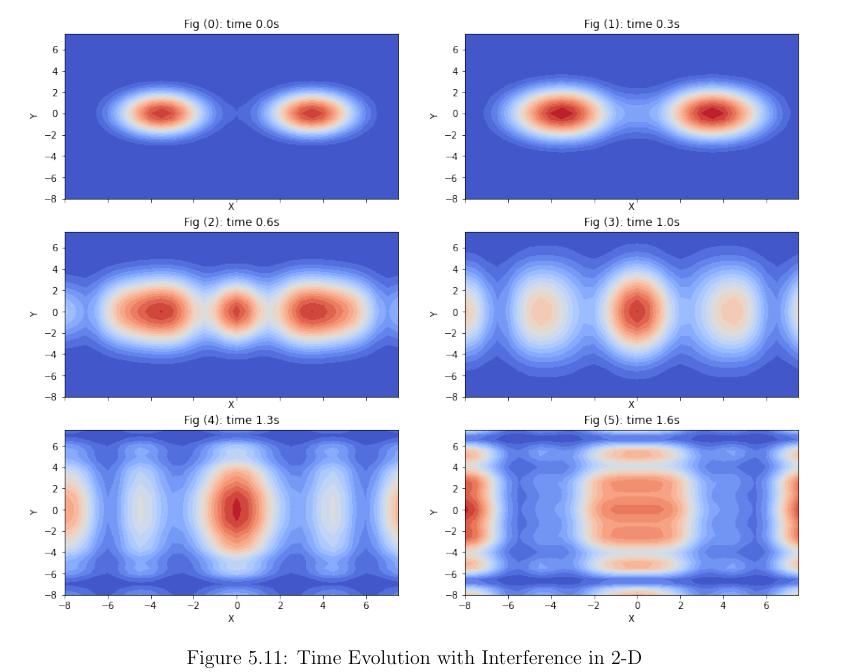

# Numerical Simulation of GP Schrodinger Equation

## Overview

This project provides a Python-based implementation for simulating the behavior of a [Bose-Einstein Condensate (BEC)](https://cdn.preterhuman.net/texts/science_and_technology/physics/State_of_Matter/Bose-Einstein%20condensation%20in%20dilute%20gases%20-%20Pethick%20C.J.,%20Smith%20H..pdf). This is acheived by solving the Gross-Pitaevskii (GP) Schrodinger equation which governs the dynamics of BECs. Two methods for solving the GP equation are provided in this module: 1) Split-Step Fourier Method (SSFM) and 2) Runge-Kutta 4 Interaction Picture (RK4IP). This module includes the ability to solve for the ground state of a BEC, time-evolve the wave function under various external potentials, and visualize the results in both 1D and 2D. Refer to the my thesis paper [BChafamo - Numerical Solver Module for the Gross-Pitaevskii Equation.pdf](https://github.com/biruk-chafamo/GP-Schrodinger-Equation-Solver/blob/065d3db1081a7b1053528b07313fd288ea65c752/BChafamo%20-%20Numerical%20Solver%20Module%20for%20the%20Gross-Pitaevskii%20Equation.pdf) for a more theoretical background.  

## Features

- **Ground State Calculation**: Solve for the ground state wave function of the BEC using imaginary time evolution.
- **Time Evolution**: Evolve the wave function in real or imaginary time using SSFM or RK4IP methods.
- **External Potentials**: Apply different external potential traps to the BEC, including symmetrical harmonic oscillators and cigar-shaped potentials.
- **Visualization**: Generate 2D and 3D plots of the wave function density and save snapshots of the wave function evolution over time.

## Snapshot
Figure 5.11 shows a simulation across time of the interference of two BEC wave functions that are
fully released from their potential trap.


## Usage

### 1. Setting Up the Simulation

First, define the constants and initialize the simulation environment:

```python
from GPE_solver import *

# Setting computational grid size and scattering length value
consts = Constants(dim=1, M=2**8, dx=5e-2, a_s=6e-3)

# Initializing the solution with an external potential
sol = Solution(constants=consts, V=V_symmetric)

# Visualize the guessed initial wave function
sol.vis.guessed_psi_plot()
```

### 2. Solving the Ground State

To solve for the ground state of the BEC, use the `solve_ground_state` method:

```python
# Solve for the ground state wave function
sol.solve_ground_state(dt=(consts.dx**2)/10, lower_bound=1e-5)

# Compare guessed and ground state wave functions
sol.vis.guessed_vs_ground_psi_plot()
```

### 3. Time Evolution

You can evolve the wave function over time with or without an external potential:

```python
# Remove the potential trap and evolve the BEC using RK4IP
sol.ext_V = 0  # Removing potential trap
sol.time_evolve(sol.ground_psi, 'RK4IP', dt=(consts.dx**2)/10, Nt=2000, snapshots=20, adaptive_step=False, dt_min=(consts.dx**2)/100)

# Visualize snapshots of the wave function evolution
sol.vis.psi_snapshots_plot_2d(plot_count=5)

# Alternative approach using SSFM
sol.time_evolve(
    sol.ground_psi, 'SSFM', dt=(consts.dx**2)/10, Nt=2000,
    snapshots=20, adaptive_step=False, dt_min=(consts.dx**2)/100)

# Visualize snapshots of the wave function evolution
sol.vis.psi_snapshots_plot_2d(plot_count=5) 
```

### 4. Interference Patterns

To simulate interference between two BEC wave functions, you can use:

```python
sol.time_evolve_interference2(
    np.roll(sol.ground_psi, -7), np.roll(sol.ground_psi, 7),
    'RK4IP', dt=(consts.dx**2)/35, Nt=250, snapshots=20, adaptive_step=False, dt_min=(consts.dx**2)/100
)

sol.vis.heat_graph(6)
```

### 5. Applying Different Potentials

Switch between different external potentials and observe the effects on the wave function:

```python
# Shifted potential example
sol.ext_V = sol.generate_external_potential(V_shifted)
sol.time_evolve(sol.ground_psi, 'RK4IP', dt=(consts.dx**2)/35, Nt=800, snapshots=20, adaptive_step=False, dt_min=(consts.dx**2)/100)
sol.vis.heat_graph(6)
```

## Customization

### External Potentials

You can define custom external potentials by creating functions that take `Constants` and `positions` as arguments:

```python
def V_custom(constants: Constants, *positions) -> np.array:
    # Custom potential definition
    return np.array([...])

# Use the custom potential in the simulation
sol = Solution(constants=consts, V=V_custom)
```

### Visualization

The `Visualization` class provides multiple methods for plotting the results, such as `guessed_vs_ground_psi_plot`, `psi_density_plot_2d`, and `heat_graph`.
